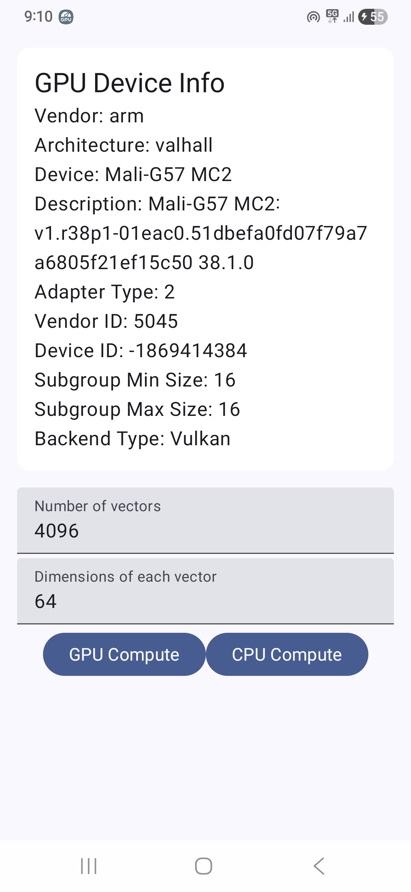
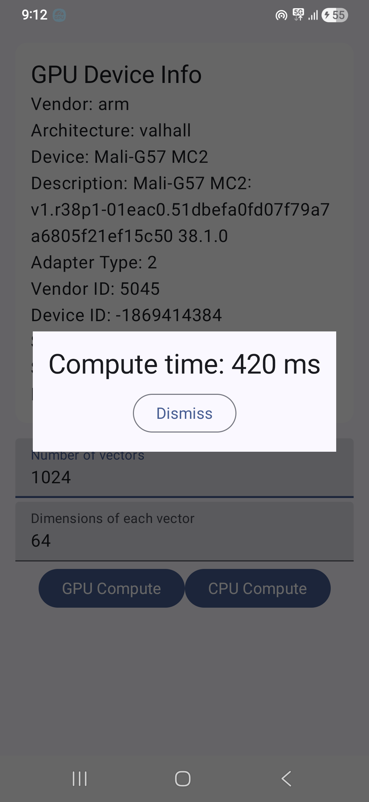

# Demo App for `androidx.webgpu` APIs

This directory contains an Android app that uses [`androidx.webgpu`](https://developer.android.com/jetpack/androidx/releases/webgpu) APIs to compute the pair-wise cosine similarity within a set of given vectors.

Checkout the [accompanying blog](https://shubham0204.github.io/blogpost/programming/androidx-webgpu) for more details.

|  |  |
|-------------------------|-------------------------| 