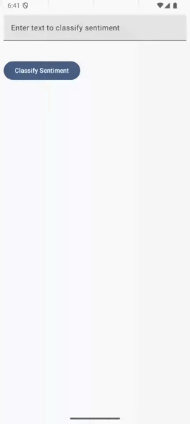
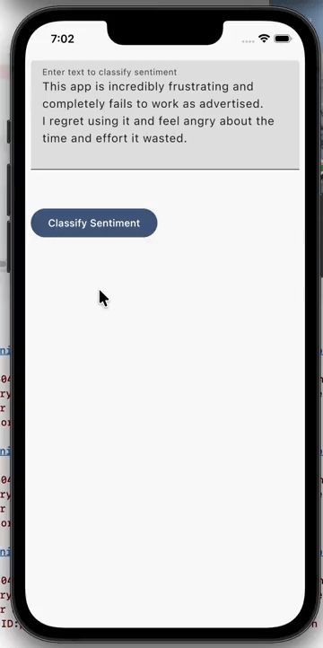
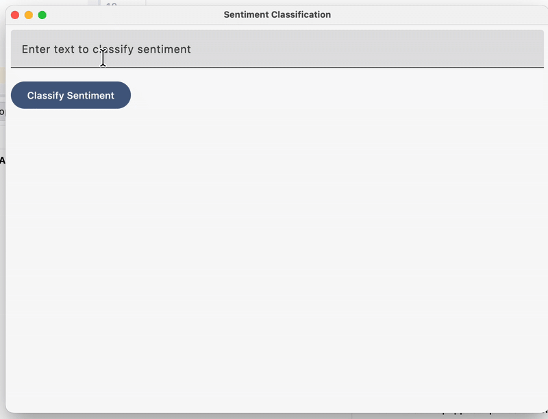

# Sentiment Classification

|  |  |  |
|---------------|---------------|---------------|

A CMP app that classifies sentiment of the input text using platform-specific APIs:

 - Android: [LiteRT's `BertNLClassifier` API](https://ai.google.dev/edge/litert/libraries/task_library/bert_nl_classifier#run_inference_in_java)
 - iOS: [Natural Language Framework](https://developer.apple.com/documentation/naturallanguage)
 - Desktop: [Stanford CoreNLP](https://stanfordnlp.github.io/CoreNLP/)

This project was created using the [Compose-Multiplatform-Wizard](https://terrakok.github.io/Compose-Multiplatform-Wizard/).

### Android
To run the application on android device/emulator:  
 - open project in Android Studio and run imported android run configuration  

To build the application bundle:  
 - run `./gradlew :androidApp:assembleDebug`  
 - find `.apk` file in `androidApp/build/outputs/apk/debug/androidApp-debug.apk`  

### Desktop
Run the desktop application: `./gradlew :desktopApp:run`  
Run the desktop **hot reload** application: `./gradlew :desktopApp:hotRun --auto`  

### iOS
To run the application on iPhone device/simulator:  
 - Open `iosApp/iosApp.xcproject` in Xcode and run standard configuration  
 - Or use [Kotlin Multiplatform Mobile plugin](https://plugins.jetbrains.com/plugin/14936-kotlin-multiplatform-mobile) for Android Studio  

